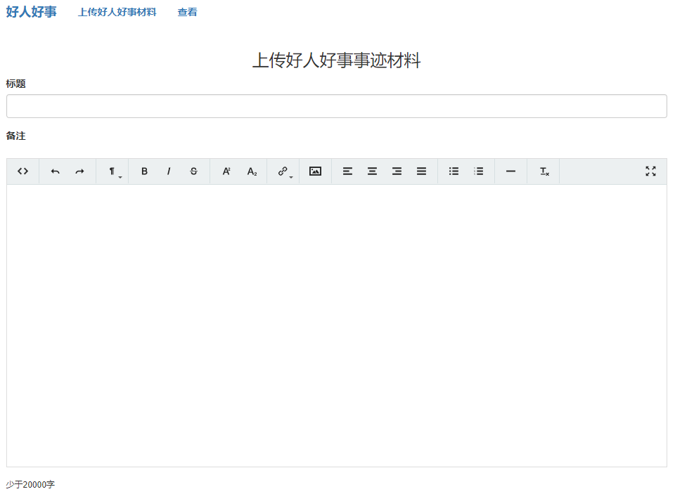
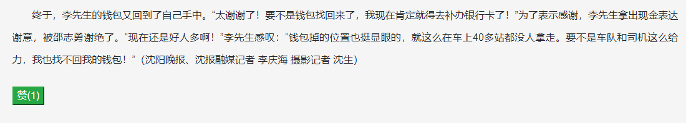

好人好事
====
这个应用提供了这样的一个平台，对好人好事进行展示，任何星云社区的用户，都可以通过“好人好事”
这个平台将自己所见所闻所感的好人好事记录到区块链上去，所有看到了这篇稿子的人，可以为这个善举
点赞。

使用步骤
===
* 上传好人好事事迹材料
    
    打开网址http://www.luoam.com/hrhs/upload.html
    
    
    填写标题和材料的内容，点击提交按钮，这时会弹出星云钱包插件窗口，成功提交交易之后，那么刚才的好人好事事迹材料就
    上传到星云链上了。
* 为好人好事材料点赞
    
    打开网址http://www.luoam.com/hrhs/index.html

    平台提供了点赞按钮。
    
    
    
智能合约
====
主网地址：n1oitVkEAcM6DoK5a8R6d6fkCkWY4K7zMZZ

<pre>
submitfact: function (title, content) {}
</pre>
submitfact方法是用来将材料写入星云链的

<pre>
factlist:function(limit, offset){}
</pre>
factlist用来从星云链上获取好人好事的材料清单

<pre>
zan: function (id) {}
</pre>
zan是在点赞时使用的，根据材料的id进行点赞